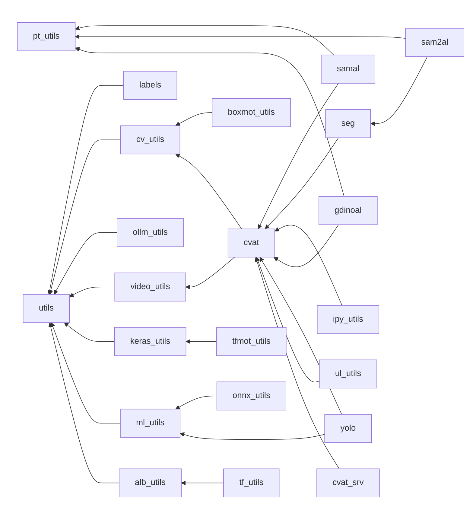

# 🧠 dl_utils: Утилиты для глубокого обучения

Набор инструментов для задач технического зрения, работы с разметкой и
автоматизации процессов глубокого обучения. Репозиторий предназначен для
подключения в основной проект как подмодуль.

## 🧩 Основные модули

### 🛠️ Утилиты общего назначения

- **[utils.py](./docs/utils.md "Перейти к документации")**: Базовые функции
(работа с файлами, логирование, измерения времени)
- **[ipy_utils.py](./docs/ipy_utils.md "Перейти к документации")**:
Инструменты для Jupyter Notebooks
- **[ollm_utils.py](./docs/ollm_utils.md "Перейти к документации")**:
Инструменты для работы с Ollama-серверами

### 🎥 Работа с видео

- **[video_utils.py](./docs/video_utils.md "Перейти к документации")**:
Захват, обработка и сохранение видео
- **[split-video.sh](./docs/split_video.md "Перейти к документации")**:
Скрипт для разделения видео на фрагменты

### 🖼️ Техническое зрение (CV)

- **[cv_utils.py](./docs/cv_utils.md "Перейти к документации")**:
Обработка изображений, визуализация аннотаций
- **[alb_utils.py](./docs/alb_utils.md "Перейти к документации")**:
- **[ul_utils.py](./docs/ul_utils.md "Перейти к документации")**: Утилиты для Ultralytics
Аугментации на базе Albumentations
- **[yolo.py](./docs/yolo.md "Перейти к документации")**:
Утилиты для работы с YOLO-моделями
- **[seg.py](./docs/seg.md "Перейти к документации")**: Сегментация изображений
- **[boxmot_utils.py](./docs/boxmot_utils.md "Перейти к документации")**: Утилиты для трекеров из BoxMOT

### ⚙️ Авторазметка

- **[samal.py](./docs/samal.md "Перейти к документации")**:
Автоматическая сегментация изображений с
[SAM](https://github.com/facebookresearch/segment-anything "Перейти к репозиторию")
- **[sam2al.py](./docs/sam2al.md "Перейти к документации")**:
Автоматическая сегментация видео с
[SAM2](https://github.com/facebookresearch/sam2 "Перейти к репозиторию")
- **[gdinoal.py](./docs/gdinoal.md "Перейти к документации")**:
Автоматическая детекция объектов с
[DINO](https://github.com/IDEA-Research/GroundingDINO "Перейти к репозиторию")

### 🏷️ Работа с CVAT

- **[cvat.py](./docs/cvat.md "Перейти к документации")**: API клиент для CVAT
- **[cvat_srv.py](./docs/cvat_srv.md "Перейти к документации")**:
Балансировка датасетов между проектами CVAT
- **[labels.py](./docs/labels.md "Перейти к документации")**:
Работа с метками, используя таблицы
[меток](./docs/labels_template.xlsx.md "перейти к документации") и
[суперметок](./docs/superlabels_template.xlsx.md "перейти к документации")

### 🤖 Глубокое обучение

- **[pt_utils.py](./docs/pt_utils.md "Перейти к документации")**:
Утилиты для PyTorch (работа с моделями, данными)
- **[tf_utils.py](./docs/tf_utils.md "Перейти к документации")**:
Инструменты для TensorFlow/Keras
- **[tfmot_utils.py](./docs/tfmot_utils.md "Перейти к документации")**:
Квантование моделей TensorFlow
- **[ml_utils.py](./docs/ml_utils.md "Перейти к документации")**:
Общие ML функции (метрики, обработка данных)
- **[onnx_utils.py](./docs/onnx_utils.md "Перейти к документации")**:
Конвертация и работа с ONNX-моделями

<!-- markdownlint-disable MD033 -->

🔄 Зависимости модулей

<!-- markdownlint-enable MD033 -->

## `>_` Bash-скрипты

- **rerun.sh**: Перезапуск скриптов при изменении кода
- **show.sh**: Вывод последних строк локфайлов в реальном времени
- **split-video.sh**: Разделение видео на фрагменты по времени

## 🐳 Docker окружение

Проект включает Docker-контейнер со всеми зависимостями.

**Скрипты управления контейнером:**

- `docker/run.sh`: Запуск контейнера с использованием всех доступных GPU
- `docker/stop.sh`: Остановка контейнера
- `docker/restart.sh`: Перезапуск контейнера
- `docker/open.sh`: Вход в консоль контейнера
- `docker/openroot.sh`: Вход в консоль контейнера под root

**Особенности использования:**

1. Репозиторий подключается как подмодуль в `main_project/*/dl_utils`, где `*` -
папка для подмодулей (например, `3rdparty`)
1. Контейнер монтирует корень главного проекта в `/workspace`
1. Пути в коде рассчитываются относительно расположения `dl_utils`

## ✨ Интерактивная предразметка (PreAnnotation)

Отдельный инструмент для автоматической детекции (GroundingDINO) или интерактивной
сегментации (SAM2) объектов на фото/видео:

- Ноутбуки для управления процессом разметки
- Поддержка GPU-ускорения
- Автоматизированная генерация масок/обрамляющих прямоугольников объектов
- Выгрузка результатов в CVAT (через API)

**Основные компоненты:**

- `PreAnnotation/Dockerfile`: Сборка образа
- `run.sh`/`stop.sh`/`restart.sh`: Запуск/остановака/перезапуск докера

---
👨‍💻Автор: **[Никита](https://disk.yandex.ru/i/2HfPHtSlAJJuyQ
"см. резюме")[Шубин](https://disk.yandex.ru/i/BxSVPalOlTq4GA "my Curriculum vitae")**  
Лицензия: [MIT](./LICENSE)
