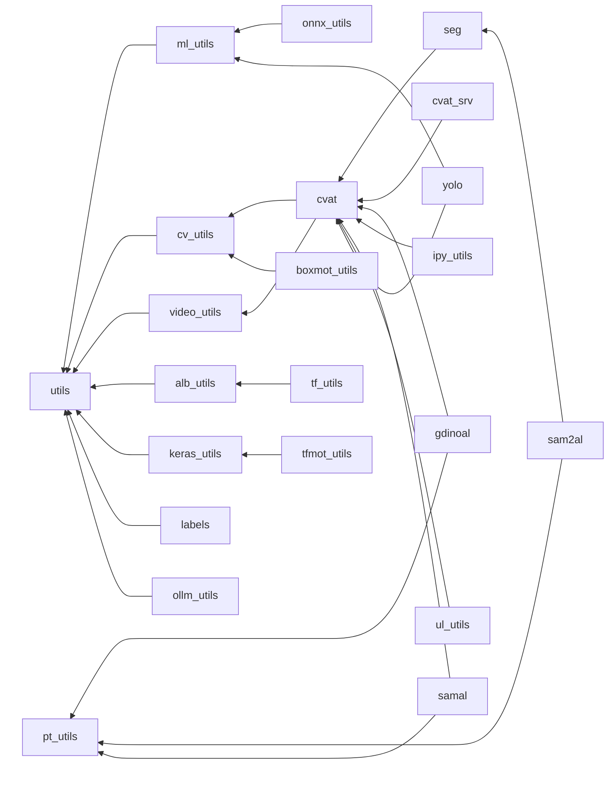

# 🧠 dl_utils: Утилиты для глубокого обучения

Набор инструментов для задач технического зрения, работы с разметкой и
автоматизации процессов глубокого обучения. Репозиторий предназначен для
подключения в основной проект как подмодуль.

## 🧩 Основные модули

### 🛠️ Утилиты общего назначения

- **[utils.py](./docs/utils.md "Перейти к документации")**: Базовые функции
(работа с файлами, логирование, измерения времени)
- **[ipy_utils.py](./docs/ipy_utils.md "Перейти к документации")**:
Инструменты для [Jupyter](https://jupyter.org/ "Перейти к документации") Notebooks
- **[ollm_utils.py](./docs/ollm_utils.md "Перейти на официальный сайт")**:
Инструменты для работы с [Ollama](https://ollama.com/ "Перейти на официальный сайт")-серверами

### 📷 Техническое зрение (CV)

- **[cv_utils.py](./docs/cv_utils.md "Перейти к документации")**:
Обработка изображений, визуализация аннотаций
- **[video_utils.py](./docs/video_utils.md "Перейти к документации")**:
Захват, обработка и сохранение видео
- **[alb_utils.py](./docs/alb_utils.md "Перейти к документации")**: Аугментации на базе
  [Albumentations](https://albumentations.ai/ "Перейти на официальный сайт")
- **[ul_utils.py](./docs/ul_utils.md "Перейти к документации")**: Утилиты для
  [Ultralytics](https://www.ultralytics.com/ "Перейти на официальный сайт")
- **[yolo.py](./docs/yolo.md "Перейти к документации")**:
Утилиты для работы с YOLO-датасетами
- **[seg.py](./docs/seg.md "Перейти к документации")**: Сегментация изображений
- **[boxmot_utils.py](./docs/boxmot_utils.md "Перейти к документации")**: Утилиты для
  трекеров из
  [BoxMOT](https://github.com/mikel-brostrom/boxmot "Перейти к репозиторию")

### ⚙️ Авторазметка

- **[samal.py](./docs/samal.md "Перейти к документации")**:
Автоматическая сегментация изображений с
  [SAM](https://github.com/facebookresearch/segment-anything "Перейти к репозиторию")
- **[sam2al.py](./docs/sam2al.md "Перейти к документации")**:
Автоматическая сегментация видео с
  [SAM2](https://github.com/facebookresearch/sam2 "Перейти к репозиторию")
- **[gdinoal.py](./docs/gdinoal.md "Перейти к документации")**:
Автоматическая детекция объектов с
  [DINO](https://github.com/IDEA-Research/GroundingDINO "Перейти к репозиторию")

### 🏷️ Работа с CVAT

- **[cvat.py](./docs/cvat.md "Перейти к документации")**: Набор утили для
  оффлайн-работы с [CVAT](https://www.cvat.ai/ "Перейти на официальный сайт")-данными
- **[cvat_srv.py](./docs/cvat_srv.md "Перейти к документации")**: Набор утили для
  онлайн-работы с серверами
  [CVAT](https://docs.cvat.ai/docs/api_sdk/sdk/ "Перейти к документации для SDK")
  (API клиент)
- **[labels.py](./docs/labels.md "Перейти к документации")**:
  Работа с метками, используя таблицы
  [меток](./docs/labels_template.xlsx.md "перейти к документации") и
  [суперметок](./docs/superlabels_template.xlsx.md "перейти к документации")

### 🤖 Глубокое обучение

- **[pt_utils.py](./docs/pt_utils.md "Перейти к документации")**:
  Утилиты для [PyTorch](https://pytorch.org/ "Перейти на официальный сайт")
  (работа с моделями, данными)
- **[keras_utils.py](./docs/keras_utils.md "Перейти к документации")**:
  Инструменты для
  [Keras](https://keras.io "Перейти на официальный сайт")
- **[tf_utils.py](./docs/tf_utils.md "Перейти к документации")**:
  Инструменты для
  [TensorFlow](https://www.tensorflow.org/ "Перейти на официальный сайт")
- **[tfmot_utils.py](./docs/tfmot_utils.md "Перейти к документации")**:
  Квантование моделей TensorFlow с помощью
  [tfmot](https://www.tensorflow.org/model_optimization "Перейти к документации")
- **[ml_utils.py](./docs/ml_utils.md "Перейти к документации")**:
  Общие ML функции (метрики, обработка данных)
- **[onnx_utils.py](./docs/onnx_utils.md "Перейти к документации")**:
  работа с [ONNX](https://onnx.ai/ "Перейти на официальный сайт")-моделями

<!-- markdownlint-disable MD033 -->

🔄 Зависимости модулей

<!-- markdownlint-enable MD033 -->

## `>_` Bash-скрипты

- **[`rerun.sh`](rerun.sh "Перейти к файлу")**: Перезапуск скриптов при изменении кода
- **[`show.sh`](show.sh "Перейти к файлу")**: Вывод последних строк локфайлов в
  реальном времени
- **[`split-video.sh`](split-video.sh "Перейти к файлу")**: Разделение видео на
  фрагменты по времени
- **[`repo2context.sh`](repo2context.sh "Перейти к файлу")**: Создание из заданной
  папки с текстовыми фафлами контекста для LLM-запросов

---

## 🐋 Docker окружение

Проект включает [Dockerfile](docker/Dockerfile "Перейти к файлу") со всеми
зависимостями.

**Скрипты управления контейнером:**

- **[`run.sh`](docker/run.sh "Перейти к файлу")**: Запуск контейнера с использованием
  всех доступных GPU
- **[`stop.sh`](docker/stop.sh "Перейти к файлу")**: Остановка контейнера
- **[`restart.sh`](docker/restart.sh "Перейти к файлу")**: Перезапуск контейнера
- **[`open.sh`](docker/open.sh "Перейти к файлу")**: Вход в консоль контейнера
- **[`openroot.sh`](docker/openroot.sh "Перейти к файлу")**: Вход в консоль контейнера
  под root

**Особенности использования:**

- Репозиторий подключается как подмодуль в `main_project/*/dl_utils`, где `*` - папка
  для подмодулей (например, `3rdparty`)
- Контейнер монтирует корень главного проекта `main_project/` в `/workspace`
- Пути в коде рассчитываются относительно расположения `dl_utils`

---

## ✨ Предразметка (PreAnnotation)

Автоматизированная генерация масок/обрамляющих прямоугольников объектов

**Основные файлы:**

- **[`Detection.ipynb`](PreAnnotation/Detection.ipynb "Перейти к файлу")**:
  Автоматическая детекция и трекинг объектов на фото и видео
  (Grounding DINO + BoxMot / YOLO)
- **[`Segmentation.ipynb`](PreAnnotation/Segmentation.ipynb "Перейти к файлу")**:
  Интерактивная сегментация объектов на видео (SAM2)

**Особенности использования:**

- Поддержка GPU-ускорения
- Выгрузка результатов в CVAT (через API)

**Компоненты Docker-контейнера:**

- **[`Dockerfile`](PreAnnotation/Dockerfile "Перейти к файлу")**:
  Сборка образа со всем необходимым внутри
- **[`run.sh`](PreAnnotation/run.sh "Перейти к файлу")** /
  **[`stop.sh`](PreAnnotation/stop.sh "Перейти к файлу")** /
  **[`restart.sh`](PreAnnotation/restart.sh "Перейти к файлу")**:
  Запуск / остановака / перезапуск докера

---
👨‍💻Автор: **[Никита](https://disk.yandex.ru/i/2HfPHtSlAJJuyQ
"см. резюме") [Шубин](https://disk.yandex.ru/i/BxSVPalOlTq4GA "my Curriculum vitae")**  
Лицензия: [MIT](./LICENSE)
